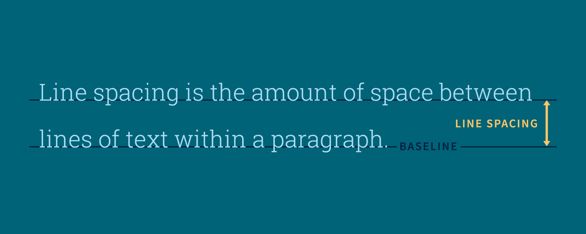
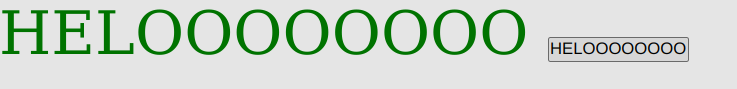

# INDEX

- [INDEX](#index)
- [HTML Reference](#html-reference)
  - [What is an HTML Element?](#what-is-an-html-element)
  - [Template of an HTML document](#template-of-an-html-document)
  - [What are HTML Attributes?](#what-are-html-attributes)
  - [What is the Role of a Web Browser in this process?](#what-is-the-role-of-a-web-browser-in-this-process)
  - [HTML Inline, Block \& Flex elements](#html-inline-block--flex-elements)
    - [Block-level element](#block-level-element)
    - [Inline element](#inline-element)
    - [Inline-block](#inline-block)
      - [Features `display: inline-block` has over `display: inline`](#features-display-inline-block-has-over-display-inline)
      - [Features `display: inline-block` has over `display: block`](#features-display-inline-block-has-over-display-block)
    - [Flexbox](#flexbox)
    - [Properties of children of a flex container](#properties-of-children-of-a-flex-container)
    - [Difference b/w `flex` and `flex-grow` property of children of a flex container](#difference-bw-flex-and-flex-grow-property-of-children-of-a-flex-container)
  - [HTML elements](#html-elements)
    - [`<a>` element (Hyperlink tag)](#a-element-hyperlink-tag)
      - [Use of href being set to `"#"` in anchor `<a>` tag](#use-of-href-being-set-to--in-anchor-a-tag)
    - [`` element](#img-element)
    - [`<div>` element](#div-element)
    - [`<header>` \& `<footer>` element](#header--footer-element)
    - [`<link>` element](#link-element)
      - [Adding an external CSS stylesheet](#adding-an-external-css-stylesheet)
      - [Adding a favicon](#adding-a-favicon)
  - [Non-breaking Space `&nbsp`](#non-breaking-space-nbsp)
- [CSS Reference](#css-reference)
  - [What is CSS?](#what-is-css)
  - [Using CSS](#using-css)
  - [Text Wrapping in CSS](#text-wrapping-in-css)
    - [What is Text Wrapping?](#what-is-text-wrapping)
  - [CSS Selectors](#css-selectors)
    - [CSS element Selector](#css-element-selector)
    - [CSS ID Selector](#css-id-selector)
    - [CSS class selector](#css-class-selector)
    - [CSS universal selector](#css-universal-selector)
  - [CSS Pseudo classes \& elements *(can't be accessed using DOM)*](#css-pseudo-classes--elements-cant-be-accessed-using-dom)
  - [CSS Pseudo-classes](#css-pseudo-classes)
    - [`:link`](#link)
    - [`:visited`](#visited)
    - [`:hover`](#hover)
    - [`:active`](#active)
    - [Anchor element (`<a>`) pseudo-classes](#anchor-element-a-pseudo-classes)
    - [Using the `:hover`/any pseudo class to modify individual child elements of the parent](#using-the-hoverany-pseudo-class-to-modify-individual-child-elements-of-the-parent)
  - [CSS pseudo-elements](#css-pseudo-elements)
    - [`::before` and `::after` pseudo-elements](#before-and-after-pseudo-elements)
  - [CSS Combinators](#css-combinators)
    - [CSS Descendant Combinator (`space`)](#css-descendant-combinator-space)
    - [CSS Child Combinator (`>`)](#css-child-combinator-)
    - [CSS General Sibling Combinator (`~`) (TODO)](#css-general-sibling-combinator--todo)
    - [CSS Adjacent Sibling Combinator (`+`) (TODO)](#css-adjacent-sibling-combinator--todo)
  - [CSS At-rules](#css-at-rules)
  - [Adding a font in CSS](#adding-a-font-in-css)
    - [Using locally downloaded fonts](#using-locally-downloaded-fonts)
    - [Using Google Fonts](#using-google-fonts)
    - [Fallback fonts](#fallback-fonts)
  - [Viewport](#viewport)
  - [Units in CSS](#units-in-css)
    - [`em` and `rem` units](#em-and-rem-units)
      - [`em` Unit](#em-unit)
      - [`rem` Unit](#rem-unit)
    - [Viewport based units](#viewport-based-units)
      - [Viewport Height `vh`](#viewport-height-vh)
      - [Viewport Width `vw`](#viewport-width-vw)
      - [Viewport Minimum `vmin`](#viewport-minimum-vmin)
      - [Viewport Maximum `vmax`](#viewport-maximum-vmax)
      - [Difference of Viewport units from percentages](#difference-of-viewport-units-from-percentages)
    - [Usage of viewport units](#usage-of-viewport-units)
  - [`width`, `margin`, `border` and `padding` of an element](#width-margin-border-and-padding-of-an-element)
  - [CSS `box-sizing` Property (`content-box` vs. `border-box`)](#css-box-sizing-property-content-box-vs-border-box)
  - [CSS `display` Property](#css-display-property)
  - [CSS `position` property (`static`, `relative`, `absolute` \& `fixed`)](#css-position-property-static-relative-absolute--fixed)
    - [Layout and the containing block](#layout-and-the-containing-block)
  - [CSS `vertical-align` property](#css-vertical-align-property)
  - [CSS `text-align` Property (Works only with `block`, not flexboxes)](#css-text-align-property-works-only-with-block-not-flexboxes)
  - [CSS `transition` Property](#css-transition-property)
  - [Setting line spacing in HTML using CSS `line-height` property](#setting-line-spacing-in-html-using-css-line-height-property)
  - [CSS properties for flexboxes](#css-properties-for-flexboxes)
    - [`flex-direction` property](#flex-direction-property)
    - [`justify-content` property](#justify-content-property)
    - [`align-items` property](#align-items-property)
    - [`flex-grow` property](#flex-grow-property)
  - [CSS properties for images](#css-properties-for-images)
    - [`border-radius` property](#border-radius-property)
  - [CSS Properties for `<button>` elements](#css-properties-for-button-elements)
  - [CSS Media Queries](#css-media-queries)
    - [Breakpoints](#breakpoints)
    - [Media types](#media-types)
    - [Media features](#media-features)
    - [Logical operators used in Media Queries](#logical-operators-used-in-media-queries)
      - [`and`](#and)
      - [`not`](#not)
      - [`only`](#only)
    - [`,` (comma)](#-comma)
- [Important Concepts](#important-concepts)
  - [Removing the underline of a hyperlink using the CSS `text decoration` property](#removing-the-underline-of-a-hyperlink-using-the-css-text-decoration-property)
  - [Why we shouldn't use `&nbsp` for creating gaps in between elements](#why-we-shouldnt-use-nbsp-for-creating-gaps-in-between-elements)
  - [Difference between `src` and `href` attribute](#difference-between-src-and-href-attribute)
    - [Difference between *parsing* and *rendering*](#difference-between-parsing-and-rendering)
  - [Using `<i>` and `<span>` for adding icons](#using-i-and-span-for-adding-icons)
  - [Why do browsers display HTML documents with some minimal amount of padding/margin?](#why-do-browsers-display-html-documents-with-some-minimal-amount-of-paddingmargin)
  - [CSS `background` vs `background-color` property](#css-background-vs-background-color-property)
  - [Difference b/w `display: none` and `visibility: hidden`](#difference-bw-display-none-and-visibility-hidden)
  - [How font-awesome icons work](#how-font-awesome-icons-work)
  - [Specificity Hierarchy in CSS](#specificity-hierarchy-in-css)
    - [**Applying styles using Javascript DOM Manipulation**](#applying-styles-using-javascript-dom-manipulation)
    - [**Using two stylesheets**](#using-two-stylesheets)
  - [Attributes of text inside `<button>` tags (Applicable for font-awesome icons as well)](#attributes-of-text-inside-button-tags-applicable-for-font-awesome-icons-as-well)
  - [Percentage based values for `margin` and `padding` are based ONLY on the containing block's ***width***](#percentage-based-values-for-margin-and-padding-are-based-only-on-the-containing-blocks-width)
- [Useful Articles \& Documentation (See Edge Bookmarks)](#useful-articles--documentation-see-edge-bookmarks)
  - [Writing Semantic HTML](#writing-semantic-html)
  - [`::before` and `:after` pseudo-elements](#before-and-after-pseudo-elements-1)
  - [A Complete Guide to Flexbox](#a-complete-guide-to-flexbox)
    - [CSS properties for flexboxes](#css-properties-for-flexboxes-1)
  - [Percentage Based values for `margin` and `padding`](#percentage-based-values-for-margin-and-padding)
  - [Layout and the containing block](#layout-and-the-containing-block-1)
  - [Block Formatting Context and Avoid OVERFLOW using `display: flow-root`](#block-formatting-context-and-avoid-overflow-using-display-flow-root)
  - [CSS Modules](#css-modules)
  
# HTML Reference

## What is an HTML Element?

An HTML element is defined by a start tag, some content, and an end tag:

```html
<tagname> Content goes here... </tagname>
```
The HTML element is everything from the start tag to the end tag:
```html
<h1>My First Heading</h1>
```
Some HTML elements have no content (like the `<br>` element). These elements are called **empty elements**. Empty elements do not have an end tag!


## Template of an HTML document

```html
<!DOCTYPE html>
<html>
<head>
<title>Page Title</title>
</head>
<body>

<p>My first paragraph.</p>

</body>
</html>
```

- `<!DOCTYPE html>` : This declaration defines that the document is an HTML5 document.<br> It is an instruction to the web browser about what version of HTML the page is written in. This ensures that the web page is parsed the same way by different web browsers. 
- `<html>` : This element is the **root** element of an HTML page and it defines the whole HTML document. 
- `<head>` : This element contains **meta information** (information about information) about the HTML page.
- `<title>` : This element specifies a title for the HTML page (which is shown in the browser's title bar or in the page's tab).
- `<body>` : This element defines the document's body, and is a container for all the visible contents (which are displayed in a browser), such as headings, paragraphs, images, hyperlinks, tables, lists, etc.
- `<p>` : This element defines a paragraph.

## What are HTML Attributes?

- HTML attributes provide additional information about HTML elements. All HTML elements can have attributes.
- Attributes are always specified in the start tag.
- Attributes usually come in name/value pairs like: `name="value"`

## What is the Role of a Web Browser in this process?

The purpose of a web browser (Chrome, Edge, Firefox, Safari) is interpret HTML files, CSS files and Javascript files into a website that should be displayed.

A browser does not display the HTML tags, rather it uses them to determine how to display the document.

## HTML Inline, Block & Flex elements

### Block-level element

A block-level element always starts on a new line, and the browsers automatically add some space (a margin) before and after the element. It always takes up the full width available (stretches out to the left and right as far as it can).

Two commonly used block elements are: `<p>` and `<div>`.

### Inline element

An inline element does not start on a new line. It only takes up as much width as necessary.

Some commonly used block elements are: ``, `<a>` and `<span>`.

### Inline-block

An element with `display: inline-block` combines properties of inline and block.

#### Features `display: inline-block` has over `display: inline` 

- allows to set a width and height on the element.
- the top and bottom margins/paddings are respected.

#### Features `display: inline-block` has over `display: block` 

- does not add a line-break after the element, so the element can sit next to other elements.

### Flexbox

flex is a value which can be assigned to the CSS `display` property of an HTML element.

A flex container expands items to fill available free space or shrinks them to prevent overflow.

Most importantly, the flexbox layout is **direction-agnostic** as opposed to the regular layouts (block which is vertically-based and inline which is horizontally-based). 

While those work well for pages, they lack flexibility to support large or complex applications (especially when it comes to orientation changing, resizing, stretching, shrinking, etc.).

### Properties of children of a flex container

The Flexbox layout gives the PARENT container the ability to alter its items’ width/height (and order) to best fill the available space in order to accommodate all kinds of display devices and screen sizes. 

NOTE that even if the container's children are `<span>` elements, which are by-default [`inline`](#inline-element) elements, their behaviour will be converted similar to [`block`](#block-level-element) or [`inline-block`](#inline-block) so that their width and height can be manipulated.

### Difference b/w `flex` and `flex-grow` property of children of a flex container

It is generally NOT advisable to use `flex-grow: 1` for all children because `flex-grow` allocates the remaining space after each child takes its minimum required space. So, the behaviour can be unpredicatable in this situation.

`flex: 1` creates a definite ratio between the children such that the total space a child takes up is equal to that ratio. 

Refer [CSS properties for flexboxes](#css-properties-for-flexboxes) below or refer the article under Useful Articles [below](#a-complete-guide-to-flexbox) for more information.

## HTML elements

### `<a>` element (Hyperlink tag)

The HTML `<a>` element defines a hyperlink. It has the following attributes: 
- `href` : Contains the URL of the destination which the hyperlink leads to.
- `title` : Specifies extra information about an element. The information is shown as a **tooltip** text when the mouse moves over the element. 
- `rel` : By setting the rel attribute to `"noreferrer"` the destination website will see the request as **Direct Traffic** instead of **Referral**. Read more about it [here](https://www.reliablesoft.net/noreferrer-noopener/#noreferrer).
- `target` :  Specifies where to open the linked document. By setting the target attribute to `"_blank"`, the linked document is opened in a new window or tab.

  Note that `target="_blank"` doesn't work in Github Flavored Markdown, meaning links from READMEs can't be opened in a new tab.

SYNTAX : 
```
<a href="url">Display text of hyperlink</a>
```
The hyperlink displays the text enclosed between the start and end tag to the user.

We can **remove the underline of a hyperlink** using [this](#removing-the-underline-of-a-hyperlink) method explained below.
<br> <br>

#### Use of href being set to `"#"` in anchor `<a>` tag

The href attribute in an HTML `<a>` (anchor) tag is used to specify the URL or location to which the link should point.

When the href attribute is set to `"#"`, it means that the link is pointing to the top of the current page. It essentially creates an ***in-page anchor***, so when the user clicks on the link, the browser will scroll to the top of the page. 

This behavior can be overridden by JavaScript.

This is often used in navigation menus or to create in-page navigation links, such as a "back to top" link.

An example of this would be:
```html
<a href="#">Back to top</a>
```
In this case, when the user clicks the link, the browser will scroll to the top of the page, but no new page is loaded or requested.

It's also worth mentioning that by default the `a` tag will trigger the page reload, which is not the behavior expected in an SPA, this is where the JavaScript events should be used to prevent the default behaviour of the a tag.

### `` element

The HTML`` element is used to embed an image in an HTML page.

Images are not technically inserted into a web page; images are linked to web pages. This element creates a holding space for the referenced image.
- `src` : Specifies the path to the image.
- `alt` : Specifies an alternate text for the image, if the image for some reason cannot be displayed. This text is also used by screen readers for telling about the image.
- `title` : Specifies the title of the image which is visible as a tooltip upon hovering on the image.

Checkout [these](#css-properties-for-images) CSS properties related to images.


### `<div>` element

The `<div>` tag is known as Division tag.

The Div is the most usable tag in web development because it helps us to separate out data in the web page and we can create a particular section for particular data or function in the web pages.

The `<div>` HTML element is a generic container for **flow content** (Flow content is a broad category that encompasses most elements that can go inside the `<body>` element, including heading elements, sectioning elements, etc). 

It has no effect on the content or layout until styled in some way using CSS.
<br> <br>

### `<header>` & `<footer>` element

`<header>` and `<footer>` are meta tags which just tell the browser that a header or a footer is being read. They behave like divs. It is recommended to use both of these tags to make our web page fully HTML5 compliant.
<br> <br>

### `<link>` element

The `<link>` element tells the relationship between the current document and an external resource.
It is most often used to link to external style sheets or to add a favicon  to a website.

It is an empty element, it contains attributes only which are as follows:
- `rel` : Specifies the relationship between the current document and the linked document.
- `href` : Specifies the location of the linked file.

#### Adding an external CSS stylesheet

```css
<link rel="stylesheet" href="/css/styles.css">
```

#### Adding a favicon

```css
<link rel="icon" href="/images/favicon.png">
```
NOTE: **favicon** is a small square image that represents a website in web browsers.

## Non-breaking Space `&nbsp`

A commonly used entity in HTML is the non-breaking space: `&nbsp;`

A non-breaking space is a space that will not break into a new line.

Two words separated by a non-breaking space will stick together (not bSreak into a new line). This is handy when breaking the words might be disruptive.

If you write 10 spaces in your text, the browser will remove 9 of them. To add real spaces to your text, you can use the `&nbsp;` character entity.

# CSS Reference

## What is CSS?

CSS (*Cascading Style Sheets*) is the language we use to style an HTML document. It is used to format the layout of a webpage, meaning how HTML elements should be displayed. <br>
NOTE: The word **cascading** refers to the fact that a style applied to a parent element will also apply to all children elements within the parent. <br>
So, if we set the color of the body text to "blue", all headings, paragraphs, and other text elements within the body will also get the same color (unless we specify something else).

## Using CSS

CSS can be added to HTML documents in 3 ways:

Priority is given in the order:

Inline styling >> Internal styling >> External styling

- **Inline** - Inline CSS uses the `style` attribute of an HTML element. This applies a unique style to a single HTML element.
```html
...
<body>
    <h1 style = "color: limegreen;"> hello world </h1>    
</body>
...
```
- **Internal** - Internal CSS is used to define a style for a single HTML page. It is defined in the `<head>` section of an HTML page, within a `<style>` element.
```html
...
<head>
<style>
body {background-color: powderblue;}
h1   {color: blue;}
p    {color: red;}
</style>
</head>
<body>

<h1>This is a heading</h1>
<p>This is a paragraph.</p>

</body>
...
```
- **External** - by using a `<link>` element to link to an external CSS file. We will be using the following attributes of the `<link>` HTML element:<br>
    - `rel` : Required. Specifies the relationship between the current document and the linked document
    - `href` : 	Specifies the location of the linked document, either as an absolute or relative URL.

```html
...
<head>    
    <link rel="stylesheet" href="css/demostyles.css">
</head>
<body>
    <h1>hello world</h1>    
    <p>my name is rohan</p>
</body>
...
```

The most common way to add CSS, is to keep the styles in external CSS files. 

## Text Wrapping in CSS

### What is Text Wrapping?


## CSS Selectors

Order of precedence for CSS:
ID > CLASS > ELEMENT

### CSS element Selector 

The element selector selects HTML elements based on the element name. <br>
Syntax:
```css
<HTML-element> {
    color: red;
}
```

### CSS ID Selector 

The id selector uses the id attribute of an HTML element to select a specific element.

**The id of an element is unique within a page**, so the id selector is used to select one unique element. 
```html
<p id = "para1">HelloWorld</p>
```

To select an element with a specific id, write a hash (#) character, followed by the id of the element. 
```css
#para1 {
    color: red;
}
```

These IDs are also useful when we want to modify elements using JavaScript.

### CSS class selector

The class selector selects HTML elements with a specific class attribute. An element can be a part of multiple classes.
```html
<p class="firstclass secondclass">HelloWorld</p>
```

To select elements with a specific class, write a period `(.)` character, followed by the class name
```css
.firstclass {
    color: red;
}
```

### CSS universal selector

An asterisk ( i.e. `"*"` ) is used to denote a CSS universal selector. An asterisk can also be followed by a selector. 

This is useful when you want to set a style for of all the elements of an HTML page or for all of the elements within an element of an HTML page. 

---

## CSS Pseudo classes & elements *(can't be accessed using DOM)*

CSS introduces the concepts of pseudo-elements and pseudo-classes to permit formatting based on information that lies outside the DOM tree.

> **NOTE:** Since, these are NOT represented in the DOM tree, these can't be accessed by javascript commands like `document.querySelector()`.

- **Pseudo-elements** create abstractions about the document tree beyond those specified by the DOM language. 
  
  For instance, DOM languages do not offer mechanisms to access the first letter or first line of an element's content. 
  
  CSS **pseudo-elements** allow style sheet designers to refer to this otherwise inaccessible information. 
  
  **Pseudo-elements** may also provide style sheet designers a way to assign style to content that does not exist in the source document (e.g., the `:before` and `:after` **pseudo-elements** give access to generated content).

- **Pseudo-classes** classify elements on characteristics other than their name, attributes or content; in principle characteristics that cannot be deduced from the DOM tree. 

  **Pseudo-classes** may be dynamic, in the sense that an element may acquire or lose a pseudo-class while a user interacts with the DOM. 
  
  > **NOTE:** The exceptions are `:first-child`, which can be deduced from the DOM tree, and `:lang()`, which can be deduced from the DOM tree in some cases.

  So basically, a pseudo-class is something you can attach a style to, but you never print it out yourself in the HTML. 
  
  Also, a pseudo-class can be ACQUIRED and LOST depending on user interaction with the UI, which can be:    
  
  - A user mousing over an element.
  - Maintaining information about visited and unvisited linked.
  - A user having **focus** on a particular element.

---

## CSS Pseudo-classes

The general syntax for using a pseudo-class is:
```css
selector:pseudo-class {
  property: value;
}
```

Some examples of pseudo-classes are:

### `:link`

We can use the `:link` selector to style links to unvisited pages.

### `:visited`

We can use the `:visited` selector to style links to visited pages.

### `:hover`

The `:hover` pseudo-class is used to select elements when you mouse over them.

Note that `:hover` can be used on all elements, not only on links.

Also, `:hover` MUST come after `:link` and `:visited` (if they are present) in the CSS definition, in order to be effective!

### `:active` 

The `:active` pseudo-class is used to select and style the active link.

A link becomes active when you click on it.

Note that `:active` can be used on all elements, not only links.

Also, `:active` MUST come after `:hover` (if present) in the CSS definition in order to be effective!

### Anchor element (`<a>`) pseudo-classes

Links can be displayed in different ways:

```css
/* unvisited link */
a:link {
  color: #FF0000;
}

/* visited link */
a:visited {
  color: #00FF00;
}

/* mouse over link */
a:hover {
  color: #FF00FF;
}

/* selected link */
a:active {
  color: #0000FF;
}
```

We use the `:link` selector to style links to unvisited pages, the `:visited` selector to style links to visited pages, and the `:active` selector to style the active link.

Note: `a:hover` MUST come after `a:link` and `a:visited` in the CSS definition in order to be effective! `a:active` MUST come after `a:hover` in the CSS definition in order to be effective! 

Pseudo-class names are not case-sensitive.

### Using the `:hover`/any pseudo class to modify individual child elements of the parent

This helps us to change properties of different children of a parent element differently upon a certain action like `:hover`.
```css
.parent-element:hover child-element { 
    /* Changing the properties of a child element upon hovering on a parent div. */
    display: block;
}
```

---

## CSS pseudo-elements

### `::before` and `::after` pseudo-elements

The `::before` and `::after` pseudo-elements in CSS allow insertion of content onto a page without it needing to be in the HTML. 

While the end result is not actually in the DOM, it appears on the page as if it is, and would essentially be like this:

```css
div::before {
  content: "before";
}
div::after {
  content: "after";
}
```html
<div>
  before
  <!-- Rest of stuff inside the div -->
  after
</div>
```

For more details, read the article listed under Useful Articles [below](#before-and-after-pseudo-elements-1) on CSS Tricks.

---

## CSS Combinators

A [CSS selector](#css-selectors) can contain more than one simple selector. 

Between the simple selectors, we can add a relationship, and that‘s called a combinator.

There are four different combinators in CSS:

- Descendant combinator (`space`)
- Child combinator (`>`)
- General sibling combinator (`~`)
- Adjacent sibling combinator (`+`)

### CSS Descendant Combinator (`space`)

The descendant combinator  matches those elements matched by the *second selector* that are descendants (DIRECT or INDIRECT) of elements matched by the *first selector*. 

The following CSS example selects all `<p>` elements inside `<div>` elements, (whether the `<p>` elements are directly in the body of the `<div>` element or nested in some other element inside the `<div>`) :

```css
div p {
  background-color: yellow;
}
```

### CSS Child Combinator (`>`)

The child selector matches only those elements matched by the second selector that are the DIRECT children of elements matched by the first.

The following example selects all `<p>` elements that are children of a `<div>` element, (only those `<p>` elements that directly in the body of the `<div>` element):

```css
div > p {
  background-color: yellow;
}
```

### CSS General Sibling Combinator (`~`) (TODO)

### CSS Adjacent Sibling Combinator (`+`) (TODO)

---

## CSS At-rules

**At-rules** are CSS statements that instruct CSS how to behave. They begin with an at sign, `@` , followed by an identifier and includes everything up to the next semicolon, `;`, or the next CSS block, whichever comes first.

Syntax:
```css
/* General structure */
@IDENTIFIER (RULE);

/* Nested Statements */
@IDENTIFIER (RULE) {

}
```

There are several regular at-rules, designated by their identifiers, each with a different syntax:

- `@charset` - Defines the character set used by the style sheet.
- `@import` - Tells the CSS engine to include an external style sheet.
- `@font-face` - Describes the aspect of an external font to be downloaded.
- `@media` - Used to apply part of a style sheet based on the result of one or more media queries. 

    With it, we specify a media query and a block of CSS to apply to the document if and only if the media query matches the device on which the content is being used.
- `@supports` - Allows specifying declarations that depend on a browser's support for one or more specific CSS features. This is called a **feature query**.
- `@namespace` - Tells the CSS engine that all its content must be considered prefixed with an XML namespace.


## Adding a font in CSS

### Using locally downloaded fonts

The best option would be to have the `.ttf` ([TrueType font standard](https://en.wikipedia.org/wiki/TrueType)) or `.otf` ([OpenType font standard](https://en.wikipedia.org/wiki/OpenType)) file downloaded locally in a `fonts` folder to ensure its availability because it might get removed in case of online sources.

The syntax for doing the same using a `font-face` declaration is:

```css
@font-face {
  font-family: <name-of-font-to-be-used>;
  src: ../fonts/Inter.ttf;
}
```

The value of the `font-family` property is name which is uused when we want to use this font somewhere in our stylesheet. The font `Inter` is taken as an example over here.

Another way to make this code more reliable is to specify the font file type in the `src` property.

```css
@font-face {
  font-family: <name-of-font-to-be-used>;
  src: 
      url('../fonts/Inter.ttf')
      format('truetype');
}
```
OR
```css
@font-face {
  font-family: <name-of-font-to-be-used>;
  src: 
      url('../fonts/Sans.otf')
      format('opentype');
}
```

### Using Google Fonts

We also have the option of using [Google Fonts](https://fonts.google.com/), which are free to use, and have more than 1000 fonts to choose from. We can copy-paste the code for a specific font which would be in the following format:
```css
@import url('https://fonts.googleapis.com/css2?family=Fascinate&display=swap');
```
into our CSS file and using the name of the font as regular (`Fascinate` in this case).

### Fallback fonts

HTML does have default fonts as well which don't require importing and our system also has its own fonts. 

The `font-family` CSS property, which specifies the font for an element, can hold several font names as a **"fallback"** system, so that in case any of our imported fonts is inaccessible, there is a backup in order to avoid unexpected behaviors.

## Viewport

The viewport is the user's visible area of a web page. The viewport varies with the device, and will be smaller on a mobile phone than on a computer screen.

Take a look at the viewport based units of CSS [below](#viewport-based-units).

## Units in CSS

### `em` and `rem` units
`rem` and `em` are scalable and relative units of size, but with `em`, the unit is relative to the font size of its parent element, while the `rem` unit is only relative to the root font size of the HTML document. 

The “r” in `rem` stands for “root”. 

#### `em` Unit 

The `em` unit allows setting the font size of an element relative to the font size of its parent. 
    
When the size of the parent element changes, the size of the child changes automatically.

Note: When `em` units are used on `font-size` property, the size is relative to the `font-size` of the parent. When used on other properties, it’s relative to the `font-size` of that element itself. 

#### `rem` Unit 

The `rem` is based upon the font-size value of the **root** element, which is the `<html>` element. 

And if the `<html>` element doesn’t have a specified font-size, the browser default value of `16px` is used. 

So here only the value of the root is considered, and there is no relation with a parent element (or the current element in case of other lengths).

### Viewport based units

There are four viewport-based units in CSS. These are `vh`, `vw`, `vmin` and `vmax`.

#### Viewport Height `vh` 

This unit is based on the height of the viewport. A value of 1vh is equal to 1% of the viewport height.

#### Viewport Width `vw`
 
This unit is based on the width of the viewport. A value of 1vw is equal to 1% of the viewport width.

#### Viewport Minimum `vmin`

This unit is based on the smaller dimension of the viewport. If the viewport height is smaller than the width, the value of 1vmin will be equal to 1% of the viewport height, and vice versa.

#### Viewport Maximum `vmax`

This unit is based on the larger dimension of the viewport. If the viewport height is larger than the width, the value of 1vmax will be equal to 1% of viewport height, and vice versa.

#### Difference of Viewport units from percentages

Viewport units may sound similar to percentages. However, they’re very different. 

In the case of percentages, the width or height of the child element is determined with respect to its parent.  

In this case, the units always stay relative to the size of the webpage.

### Usage of viewport units

We can set an HTML element to take the full height of the screen visible to the user.

```css
body {
    min-height: 100vh;
}
```

## `width`, `margin`, `border` and `padding` of an element

Width:

Padding: 

Border: Note that border doesn't have any width

<!--- TODO insert illustration --->

- Note that `margin`, `border`,  `padding` and `width` property combined account for the overall width of an element.

    It's not like `width` is relative to the parent and `margin` and `padding` is relative to the `width`. 

    For example, if we keep the `width` property of a block to be 25% and `padding` property of a block to be 25%, the block will combined take up 50% of its parent.

- **Also NOTE**: Remember that if suppose `margin` is set as:

    ```css
    .body {
        margin: 10vh 10vw;
    }
    ```

    This means that the total vertical margin is `20vh` (`10vh` above and `10vh` below) and the total horizontal margin is `20vw` (`10vw` on the left and `10vw` on the right).

## CSS `box-sizing` Property (`content-box` vs. `border-box`)

The `box-sizing` CSS property sets how the total width and height of an element is calculated.

- `content-box` gives us the default CSS box-sizing behavior. 

    If we set an element's width to 100 pixels, then the element's content box will be 100 pixels wide, and the width of any border or padding will be added to the final rendered width, making the element wider than 100px.

    It can be thought of intuitively in the sense that only the 'content' is included in the 'box' whose size we are specifying.

- `border-box` tells the browser to account for any border and padding in the values we specify for an element's width and height. 

    If you set an element's width to 100 pixels, that 100 pixels will include any border or padding you added, and the content box will shrink to absorb that extra width. This typically makes it much easier to size elements.

    It can be thought of intuitively in the sense that both the 'content' and the 'border' is included in the 'box' whose size we are specifying.

## CSS `display` Property

The `display` property specifies the display behavior (the type of rendering box) of an element.
Some common values for the display property are `inline`, `block`, `inline-block` and `flex`.

SYNTAX:
```css
.class-name {
    display: display-property-value;
}
```

## CSS `position` property (`static`, `relative`, `absolute` & `fixed`)

The position CSS property sets how an element is positioned in a document. 

The `top`, `right`, `bottom`, and `left` properties determine the final location of positioned elements.

### Layout and the containing block

The ***containing block*** of an element is what impacts its size and position. 

The [percentage-based padding or margin](#percentage-based-values-for-margin-and-padding-are-based-only-on-the-containing-blocks-width) we give to an element is relative to this ***containing block***.

> NOTE: The ancestor of an element is the element inside which it is contained.
> 
> ```html
> <body>
>   <div>
>     <p>hello</p>
>   </div>
> </body>
> ```
>
> Over here, `body` is the ancestor element of `div`, and `div` is the descendant of `body`. `div` is the ancestor element of `p`, and `p` is the descendant of `div`.

Most often, the ***containing block*** is the content area of an element's nearest block-level **ancestor**, but this is not always the case.

Read the complete reference on what an element's ***containing block*** is on MDN from the Useful Articles list [below](#layout-and-the-containing-block-1).

## CSS `vertical-align` property

TODO

## CSS `text-align` Property (Works only with `block`, not flexboxes)

The `text-align` CSS property sets the horizontal alignment of the inline-level content inside a block element or table-cell box. This means it works like [vertical-align]() but in the horizontal direction.

Even if we apply this property on an element containing nested elements, the text from each of the nested elements will be centered horizontally.

## CSS `transition` Property

CSS transitions allows us to change property values smoothly, over a given duration.

To create a transition effect, we must specify two things:

- the CSS property we want to add an effect to 
- the duration of the effect

Note: If the duration part is not specified, their will be no transition, rather the change will take place instantly, because the default value is 0.

An example of usage of `transition` property:
```css
.nav-bar-button {
  width: 100px;
  height: 100px;
  background: red;
  transition: width 2s;
  /*The width will change over 2 seconds*/
}
```

We can use the `:hover` selector in conjunction with this to make an element change its property smoothly when we hover over it.

## Setting line spacing in HTML using CSS `line-height` property

Line spacing is the amount of space between lines of text within a paragraph (`<p>` element of HTML) in HTML.



It can be set by using the `line-height` property of CSS. 
The line height refers to the total height of a line including the height of the font and the space above it.

`line-height` is usually set as a percentage, which is in reference to the height of the font. 

An acceptable value is 150%, which means the distance between the base of a line and the letters of the line below it would be half the height of the letters of that particular font.

## CSS properties for flexboxes

Refer the articles listed under Useful Articles [below](#css-properties-for-flexboxes-1) for more in-depth explanation.

SYNTAX:
```css
.class-name {
    display: flex;
    flex-direction: row OR column;
    justify-content: ;
    flex-grow: 1;
    align-items: ;
}
```

### `flex-direction` property

This establishes the main-axis, thus defining the direction flex items are placed in the flex container.


### `justify-content` property

This property defines the alignment along the **main-axis**. It helps distribute extra free space leftover when either all the flex items on a line are inflexible, or are flexible but have reached their maximum size.

The possible values of this property are `flex-start`, `flex-end`, `space-around`, `space-between`, `space-evenly` and `center`.


### `align-items` property

This property defines the default behavior for how flex items are laid out along the cross axis on the current line. We can think of it as the justify-content version 
for the **cross-axis** (perpendicular to the main-axis).


### `flex-grow` property

(Note that it is advisable to use `flex` property instead of `flex-grow`. 
Check out the explanation over [here](#difference-bw-flex-and-flex-grow-property-of-children-of-a-flex-container).)

This defines the ability for a flex item to grow **if necessary**. It accepts a unitless value that serves as a proportion. It dictates what amount of the available space inside the flex container the item should take up.

If all items have `flex-grow` set to 1, **the remaining space in the container** will be distributed equally to all children. If one of the children has a value of 2, that child would take up twice as much of the space either one of the others (or it will try, at least).


If only one item has the `flex-grow` property, it will take up all the remaining available space.

## CSS properties for images

SYNTAX:
```css
.class-name-of-image {
    border-radius: 50%
}
```

### `border-radius` property

This property is useful for rounding corners of images. 
It can also be used to display images which are actually square but with a circular border, by setting the property value to `50%`.

## CSS Properties for `<button>` elements 

It is advisable to keep the font size and the dimensions of the buttons in relative units like `rem`.

## CSS Media Queries

Media queries are useful when you want to modify your site or app depending on a device's general type (such as `print` vs. `screen`) or specific characteristics and parameters (such as screen resolution or browser viewport width).

Syntax:
```css
/* General Syntax */
@media not|only mediatype and (expressions) {
  CSS-Code;
}
/* Example */
@media only screen and (min-width: 900px) {
  body {
    margin: 10vh 20vw;
  }
}
```

### Breakpoints

CSS breakpoints are points where the website content responds according to the device width, allowing you to show the best possible layout to the user. 

CSS breakpoints are also called media query breakpoints, as they are used with media query.

### Media types

Media types describe the general category of a device. 

Except when using the `not` or `only` logical operators, the media type is optional and the `all` type is implied.

- `all` : Suitable for all devices.

- `print` : Intended for paged material and documents viewed on a screen in print preview mode. 

- `screen` : Intended primarily for screens.

It is also possible to have different stylesheets for different medias, for example:
```html
<link rel="stylesheet" media="mediatype and|not|only (expressions)" href="print.css">
```

### Media features

Media features describe specific characteristics of the **user agent** (a computer program representing a person, for example, a browser in a Web context), output device, or environment. 

Media feature expressions test for their presence or value, and are entirely optional. Each media feature expression must be surrounded by parentheses.

Some examples of media features are: 

- `max-width`: The maximum width of the device in question for which the media query will be evaluated to true.

- `min-width`: The minimum width of the device in question for which the media query will be evaluated to true.

Take a look at [MDN docs](https://developer.mozilla.org/en-US/docs/Web/CSS/@media#media_features) for all media features, both deprecated and non-deprecated.

### Logical operators used in Media Queries

The logical operators `not`, `and`, and `only` can be used to compose a complex media query. We can also combine multiple media queries into a single rule by separating them with commas `,`.

#### `and` 

Used for combining multiple media features together into a single media query, requiring each chained feature to return true for the query to be true. 

It is also used for joining media features with media types.

#### `not` 

Used to negate a media query, returning true if the query would otherwise return false. 

If you use the `not` operator, you must also specify a media type.

In Media Queries level 3, the not keyword can't be used to negate an individual media feature expression, only an entire media query.

#### `only`

Applies a style only if an entire query matches. 

It is useful for preventing older browsers from applying selected styles. When not using `only`, older browsers would interpret the query `screen and (max-width: 500px)` as `screen`, ignoring the remainder of the query, and applying its styles on all `screens`. 
    
If you use the `only` operator, you must also specify a media type.

### `,` (comma)

Commas are used to combine multiple media queries into a single rule. Each query in a comma-separated list is treated separately from the others. 

Thus, if any of the queries in a list is true, the entire media statement returns true. 
    
In other words, lists behave like a logical `or` operator.

# Important Concepts

## Removing the underline of a hyperlink using the CSS `text decoration` property

By setting the `text-decoration` of a certain class to none, the hyperlinks of that particular class will not be underlined, as links generally are by default. 
```css
.class-name {
    text-decoration: none;
}
```
Be careful when removing the text decoration on anchors since users often depend on the underline to denote hyperlinks.

This is useful for removing hyperlink underlines from nav bars, a place where it's obvious a hyperlink is present and where we want to add our own formatting to the text.

## Why we shouldn't use [`&nbsp`](#non-breaking-space-nbsp) for creating gaps in between elements

This character shouldn't be used in webpages to create gaps because it is absolute in nature, which creates problems in responsiveness as the gap between two elements will remain fixed while everything else changes.

## Difference between `src` and `href` attribute

There is a differentiation between src and href and they can't be used interchangeably. We use `src` for **replaced elements** (A replaced element is any element whose appearance and dimensions are defined by an external resource.) while `href` is used for establishing a relationship between the referencing document and an external resource.

`href` (Hypertext Reference) attribute specifies the location of a Web resource thus defining a link or relationship between the current element (in case of anchor `<a>`) or current document (in case of `<link>`) and the destination anchor or resource defined by this attribute. When we write:

```html
<link href="style.css" rel="stylesheet" />
```

The browser understands that this resource is a `stylesheet` and the [**parsing**](#difference-between-parsing-and-rendering) (analyzing the code according to syntax rules) of the page is not paused ([**rendering**](#difference-between-parsing-and-rendering) might be paused since the browser needs the style rules to paint and render the page). It is not similar to dumping the contents of the css file inside the `<style>` tag. (Hence it is advisable to use `<link>` rather than `@import` for attaching stylesheets to your html document.)

`src` (Source) attribute just embeds the resource in the current document at the location of the element's definition. For eg. When the browser finds

```html
<script src="script.js"></script>
```

The loading and processing of the page is paused until this the browser fetches, compiles and executes the file. It is similar to dumping the contents of the js file inside the `<script>` tag. 

Similar is the case with `` tag. It is an empty tag and the content, that should come inside it, is defined by the `src` attribute. The browser pauses the loading until it fetches and loads the image.

This is the reason why it is advisable to load all JavaScript files at the bottom (before the `</body>` tag) to prevent frequent loading.

### Difference between *parsing* and *rendering*

- Parsing turns arrays of pixels or sequences of letters into concepts. 
    
    Rendering turns concepts into arrays of pixels or sequences of letters. 

- Parsing seeks to infer a symbolic representation from sensory input (typed source code).
    
    Rendering turns said symbolic representation into a sensory experience. 

So over here, parsing is an intermediate step to rendering. Parsing a page means taking the source code (sequence of letters) and using syntactical rules to make logical sense of it. This logic is then used to display pixels on the screen (rendering).

## Using `<i>` and `<span>` for adding icons

`<i>` is used for icons because it is:

- Short
- **i** can mean icon (although not in HTML)
- It adds semantic meaning to an icon element.

    The alternative option to carry an icon class by itself is `<span>`, which of course has no semantic meaning whatsoever. When a machine asks the `<span>` what it contains, it says, "I don't know. Could be anything." 
    
    But the `<i>` tag says, "I contain a different way of saying something than the usual way, or maybe an unfamiliar term." That's not the same as "I contain an icon," but it's a lot closer to it than `<span>` got!

It is an awful practice but it is a triumph of performance over semantics.

## Why do browsers display HTML documents with some minimal amount of padding/margin?

Languages are originally built to work independently. So that you could technically use that particular language for what is intended for only. In the case of HTML, it is only supposed to allow you to display something on a browser. 

CSS on the other hand, is intended to create all the beautification process. 

So, with that in mind, Anyone should be able to write an HTML document WITHOUT any CSS at all and browsers should display it in the most legible form. Now, for this to happen as consistent as possible, browsers have something called "sane defaults". 

These defaults cover the margin and padding on the body, some fonts, the most legible font size, etc. And they leave it up to you to overwrite as needed with CSS.

Without the margin and padding on the body, everything would be completely flushed to the browser window. That is not the best practice if you were reading a document.

## CSS `background` vs `background-color` property 

The `background-color` property is only for change the color of the background whereas `background` can be used for specifying numerous characteristics for the background. 

For example:
```css
.class-1{
    background-color: yellow;
}
.class-2{
    background: red url(“image_cat.png”) no-repeat right top;
}
```

## Difference b/w `display: none` and `visibility: hidden`

We can hide an element in CSS using the CSS properties, `display: none` and `visibility: hidden`.

But, they are slightly different in how they work.

- `display:none` removes the element from the document. It does not take up any space.

- `visibility:hidden` hides the element, but it still takes up space in the layout, preserving the positions of other non-hidden elements. 

## How font-awesome icons work
<!-- TODO: complete -->

A content delivery network is used to obtain font-awesome icons. The syntax is the same as importing a CSS stylesheet.

```html
<link rel="stylesheet" href="css/styles.css">

<link rel="stylesheet" href="https://cdnjs.cloudflare.com/ajax/libs/font-awesome/6.1.1/css/all.min.css">
```

---

## Specificity Hierarchy in CSS

If there are two or more CSS rules that point to the same element, the selector with the highest specificity value will "win", and its style declaration will be applied to that HTML element.

> **_NOTE:_** If a rule from the same style sheet, with the same level of specificity exists, the rule that is declared last in the CSS document will be the one that is applied.

Think of specificity as a score/rank that determines which style declaration is ultimately applied to an element.

In layman's terms, the more specific CSS selector's rules will apply. For example, we have the following HTML page:

```html
<div class="first-level">
    <div class="second-level">
        <div class="third-level">
            This is placeholder text
        </div>            
    </div>
</div>
```

```css
.first-level .second-level .third-level {
  color: red;
}

.second-level .third-level {
  color: green;
}

.third-level {
  color: yellow;
}
```

Comparing the first two selectors: 

- the first selector is specifically targeting an element having class `third-level`, with its parent as `second-level` and grand-parent as `third-level`.
- the second selector is specifically targeting an element having class `third-level`, with its parent as `second-level` and no specified grand-parent.
  
So, we can see that the first-selector is more **specific** in its targeting.

If the specifity of all 3 selectors would have been equal, then the last set of CSS rules (`color: yellow`) would have applied (as explained above).

But, the first selector has three classes, making its specificity maximum. 

So, the CSS rule (`color: red`) would apply.

### **Applying styles using Javascript DOM Manipulation**

Note that if we apply styles using javascript DOM like this:

```javascript
document.querySelector("div > p").style.color = "red";
```

These styles will take precedence over any other styles.

### **Using two stylesheets**

Considering a case where we have two local stylesheets, `style1.css` and `style2.css`, linked one after the other

```html
<head>
...
  <link rel="stylesheet" href="css/style1.css">
  <link rel="stylesheet" href="css/style2.css">
  ...
</head>
```

`style1.css`:

```css
.green {
  color: green;
}
```

`style2.css`:

```css
.brown {
  color: brown;
}
```

Now, if suppose the body looks something like this:

```html
<body>
  <span class="green brown">Green or Brown?</span>
  <span class="brown green">Green or Brown?</span>
</body>

```
The order in which the classes are written does **NOT** matter, so both the `<span>` elements will be the same color. What will matter, will be which stylesheet was linked later in the html code. 

As we can see, `style2.css` (which contains `.brown` class) was linked later so the text will be brown.

---

## Attributes of text inside `<button>` tags (Applicable for font-awesome icons as well)

We known that in general, if no there are no EXPLICITLY specified values for a particular property for a particular child element, the EXPLICITLY specified values of THAT particular property for its parent element are applicable on the child as well.

But, in the case child `<button>` elements, this is NOT the case atleast for font properties.

Consider the following html and css code:
```html
<body>
    <div class="special-font">
        <span>HELOOOOOOOO</span>
        <button><span>HELOOOOOOOO</span></button>
    </div>
    <script src="./script.js"></script>
</body>
```

```css
.special-font { 
    color: green;
    font-family: "Serif";
    font-size: xxx-large;
}
```

The expected behaviour would be for both the fonts to be the same. But, the actual behaviour is as follows:



So, in order to change the font properties of text inside buttons, we need to use 
`button` css selector, or assign a class or ID to the `button` element or the `span` elements inside.

---

## Percentage based values for `margin` and `padding` are based ONLY on the containing block's ***width***

Yes, you read that right, the margin and padding of a child element in percentage is the percentage of the width of its [containing block](#layout-and-the-containing-block), even for `padding-top`, `padding-bottom`, `margin-top` and `margin-bottom`.

This can be seen from the following extract from the [CSS2 Spec](https://www.w3.org/TR/2011/REC-CSS2-20110607/box.html#padding-properties):


> The properties defined in this section refer to the  `<padding-width>` value type, which may take one of the following values:
>
> `<length>` : Specifies a fixed width.
>
> `<percentage>` : The percentage is calculated with respect to the width of the generated box's containing block, even for `padding-top` and `padding-bottom`. If the containing block's width depends on this element, then the resulting layout is undefined in CSS 2.1.
>
> Unlike margin properties, values for padding values cannot be negative. 
> 
> Like margin properties, percentage values for padding properties refer to the width of the generated box's containing block.

BUT, the height of the child element in percentages is still with respect to the ***height*** of the parent element.

Read about this further from the link provided [below](#percentage-based-values-for-margin-and-padding).

# Useful Articles & Documentation (See Edge Bookmarks)

## Writing Semantic HTML

## `::before` and `:after` pseudo-elements

## A Complete Guide to Flexbox

### CSS properties for flexboxes

## Percentage Based values for `margin` and `padding`

## Layout and the containing block

## Block Formatting Context and Avoid OVERFLOW using `display: flow-root`
## CSS Modules
